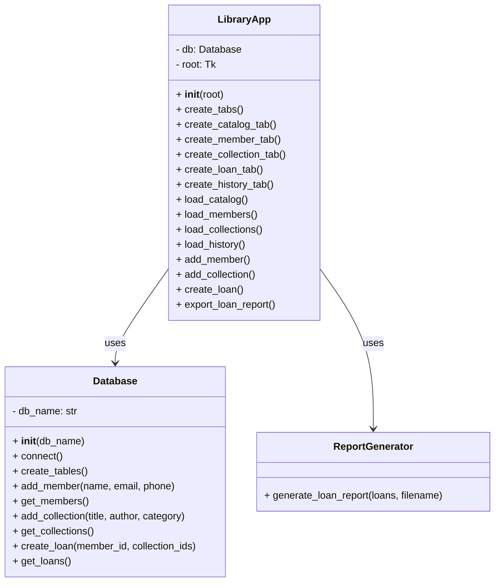

```mermaid
classDiagram
    class Database {
        - db_name: str
        + __init__(db_name)
        + connect()
        + create_tables()
        + add_member(name, email, phone)
        + get_members()
        + add_collection(title, author, category)
        + get_collections()
        + create_loan(member_id, collection_ids)
        + get_loans()
    }

    class LibraryApp {
        - db: Database
        - root: Tk
        + __init__(root)
        + create_tabs()
        + create_catalog_tab()
        + create_member_tab()
        + create_collection_tab()
        + create_loan_tab()
        + create_history_tab()
        + load_catalog()
        + load_members()
        + load_collections()
        + load_history()
        + add_member()
        + add_collection()
        + create_loan()
        + export_loan_report()
    }

    class ReportGenerator {
        + generate_loan_report(loans, filename)
    }

    LibraryApp --> Database : uses
    LibraryApp --> ReportGenerator : uses
```
