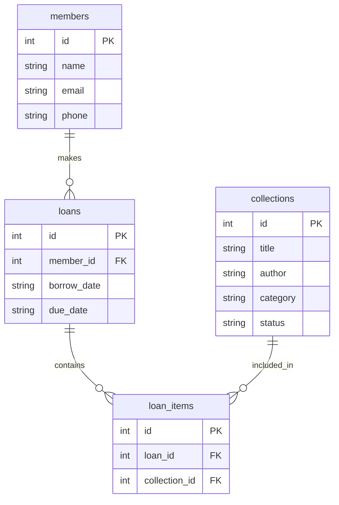

```mermaid
erDiagram
    members ||--o{ loans : makes
    loans ||--o{ loan_items : contains
    collections ||--o{ loan_items : included_in

    members {
        int id PK
        string name
        string email
        string phone
    }

    collections {
        int id PK
        string title
        string author
        string category
        string status
    }

    loans {
        int id PK
        int member_id FK
        string borrow_date
        string due_date
    }

    loan_items {
        int id PK
        int loan_id FK
        int collection_id FK
    }
```
