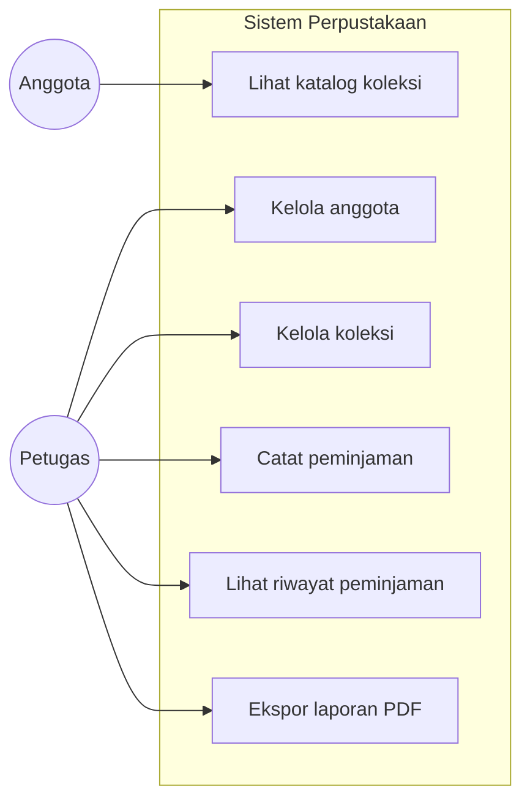

```mermaid
flowchart LR
    Anggota((Anggota))
    Petugas((Petugas))

    subgraph Sistem["Sistem Perpustakaan"]
        UC1["Lihat katalog koleksi"]
        UC2["Kelola anggota"]
        UC3["Kelola koleksi"]
        UC4["Catat peminjaman"]
        UC5["Lihat riwayat peminjaman"]
        UC6["Ekspor laporan PDF"]
    end

    Anggota --> UC1

    Petugas --> UC2
    Petugas --> UC3
    Petugas --> UC4
    Petugas --> UC5
    Petugas --> UC6
```
